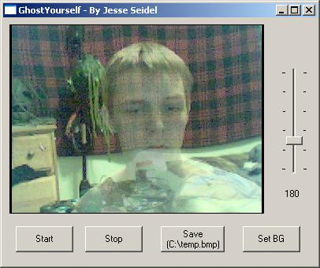



## GhostYourself \(Make yourself translucent using a webcam\!\) No joke\!

### Description

This will make you actually be able to see what's behind you right through your body in real-time! No joke! Read the directions inside the .ZIP to find out how this is done! The directions are simple. You need a webcam to do this obviously. Please leave feedback and suggestions.
 
### More Info
 

             |
---                |---
**Submitted On**   |2005-01-02 22:02:28
**By**             |[Jesse Seidel \(Dr\. Fire\)](https://github.com/Planet-Source-Code/PSCIndex/blob/master/ByAuthor/jesse-seidel-dr-fire.md)
**Level**          |Advanced
**User Rating**    |4.8 (19 globes from 4 users)
**Compatibility**  |VB 6\.0
**Category**       |[Graphics](https://github.com/Planet-Source-Code/PSCIndex/blob/master/ByCategory/graphics__1-46.md)
**World**          |[Visual Basic](https://github.com/Planet-Source-Code/PSCIndex/blob/master/ByWorld/visual-basic.md)
**Archive File**   |[GhostYours183592132005\.zip](https://github.com/Planet-Source-Code/jesse-seidel-dr-fire-ghostyourself-make-yourself-translucent-using-a-webcam-no-joke__1-58072/archive/master.zip)

